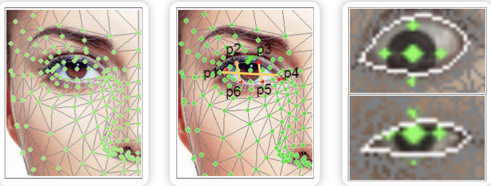
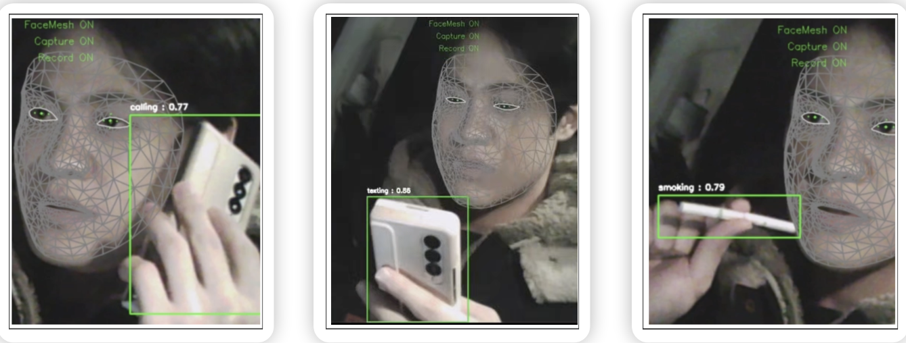

# Important
- Driver Monitoring System
- We are using AI to provide drowsiness detection step-by-step and abnormal behavior detection services to drivers using this system

# Drowsiness Detection Step-By-Step
- Step 1: Close your eyes +1 Open your eyes -1 frame. Cumulatively, 10 times, the 1st notification will guide you to a rest area and rest area within 5km in front of you
- Step 2: After detecting drowsiness in the second stage, it is continuously accumulated, and the ability to detect drowsiness in 15 checks and to notify and capture the voice
- Step 3: Provide siren notifications every 3 seconds when continuously sensing drowsiness

# Abnormal Behavior Detection
- Calling: Using the YOLOv8n model, the learned data set is detected with Ultralytics YOLO and the threshold is measured below 0.4 starting with the initial detection threshold of 0.65
- Texting: Using the YOLOv8n model, the learned data set is detected with Ultratics YOLO, and the threshold is measured from the initial detection threshold of 0.65, to 0.4 or less to detect mobile phone text and mobile phone usage
- Smoking: Using the YOLOv8n model, the learned data set is detected with Ultralytics YOLO, starting with the initial detection threshold of 0.65, and measuring the threshold below 0.4 to detect smoking with the initial detection threshold of 0.65, and measuring the threshold below 0.4 to detect smoking

# Installation
```shell
git clone https://github.com/jihyun-log/AI-DMS-project.git
```


# Original YOLOv8 model
The original YOLOv8 model can be found in this repository: [YOLOv8 Repository](https://github.com/ultralytics/ultralytics)
- The License of the models is GPL-3.0 license: [License](https://github.com/ultralytics/ultralytics/blob/main/LICENSE)


# Run

 * **Drowsiness Detection & Abnormal Behavior Detection System**:
 ```shell
 python main(YOLOv8).py
 ```

 * **Drowsiness Detection System**:
 ```shell
 python main.py
 ```

 * **Provide the pose_estimation information**:
 ```shell
 python pose_main.py
 ```

 * **The eye tracking function that we want to put in the future**:
 ```shell
 python gazetimation_main.py
 ```

 * **The Face3D function that we want to put in the future**:
 ```shell
 python webcam_Background_Face.py
 ```

# DMS System(Demo)
 

# The functions that we want to put in the future(Demo)
 


# References:
* YOLOv8 model: [https://github.com/ultralytics/ultralytics](https://github.com/ultralytics/ultralytics)
* Gazetimation: [https://github.com/paul-shuvo/gazetimation/tree/release](https://github.com/paul-shuvo/gazetimation/tree/release)
* Real Time Driver State Detection: [https://github.com/e-candeloro/Driver-State-Detection](https://github.com/e-candeloro/Driver-State-Detection)
* Face3D: [https://github.com/abdallahdib/NextFace?tab=readme-ov-file](hhttps://github.com/abdallahdib/NextFace?tab=readme-ov-file)
